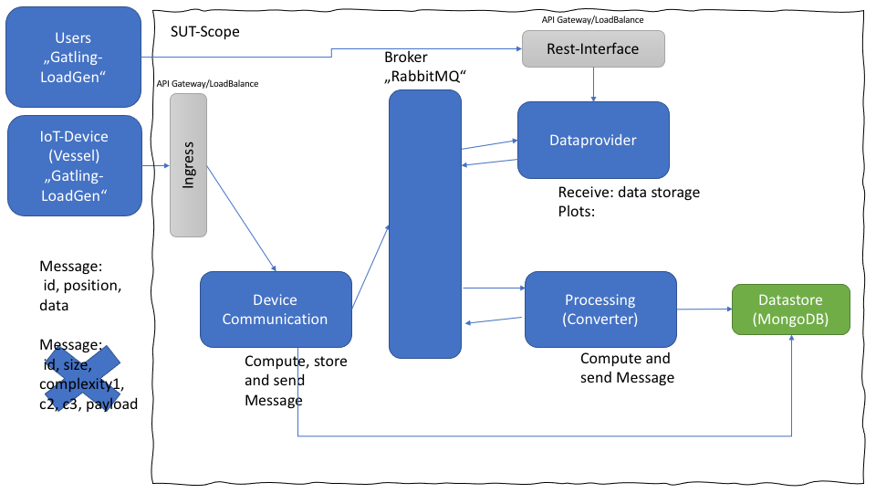

# The Demonstrator  

The "Demonstrator" is a Remote Measuring Case. It was built during the MOSAIC project.  
It comprises three main services "Data Provider", "Data Processing" and "Device Communication". It also includes a MongoDB for data storage and the messaging is handled by a RabbitMQ broker.  
(Insert image here)  
The Demonstrator can be deployed on a kubernetes cluster as describe in the Demonstrator Setup Instructions.  
We will use the Demonstrator to evaluate different autoscalers. For that we will create scaling configurations for the Demonstrator project and then test them on the running system. To trigger the different scaling behaviors we will use a load generator.

The Demonstrator functions using three main components. 

- Device Communication sends Messages through the RabbitMQ Broker
- Data Provider receives Messages and communicates with the RabbitMQ Broker
- Data Processing computes Messages and communicates with the RabbitMQ Broker

